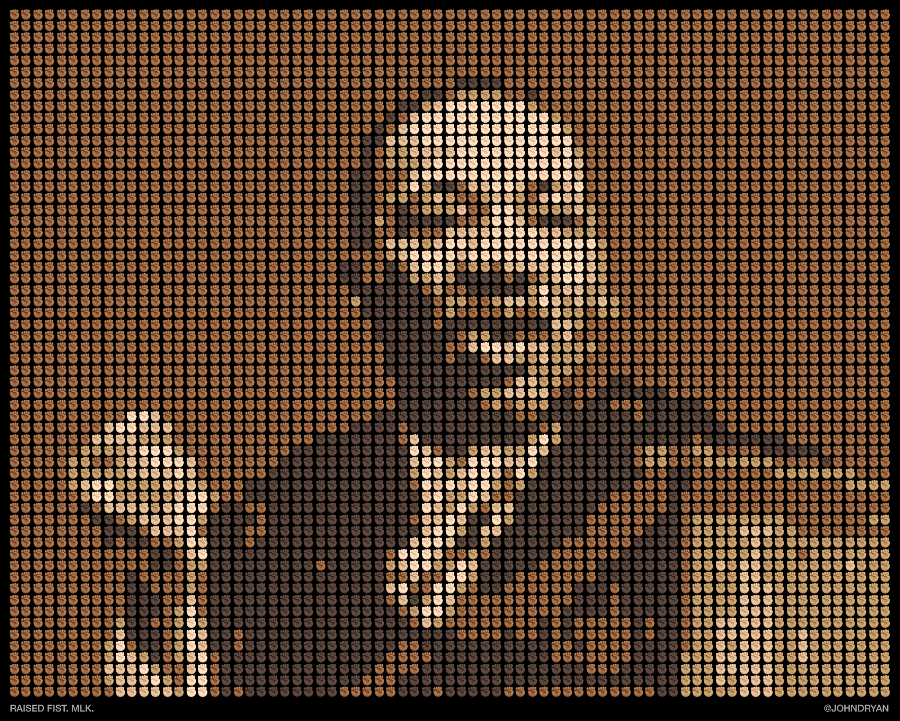

# Emoji Portraits

A series of portraits to celebrate [Apple’s new racially diverse emoji](http://mashable.com/2015/02/26/diverse-emoji-explainer/).

### “Raised Fist. MLK. ✊”



### “Person with Folded Hands. Gandhi. 🙏”


## How to use

Run the emojify.py script with the following parameters:

```./emojify.py sourceImages/image.jpg output/emojiportrait.txt```